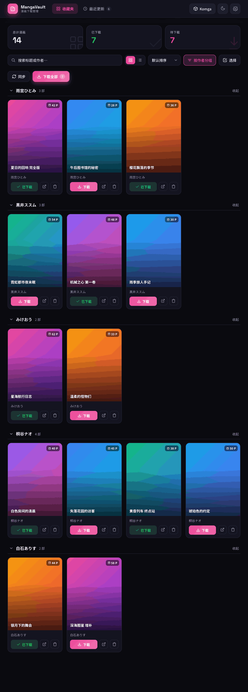
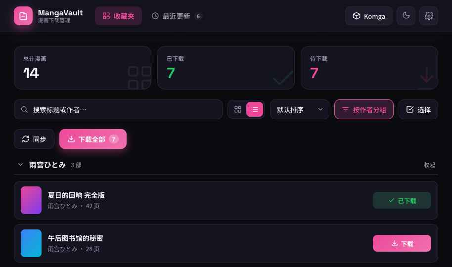
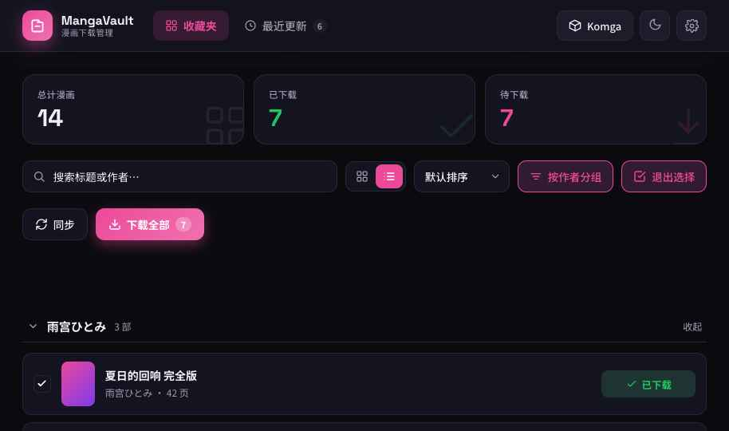
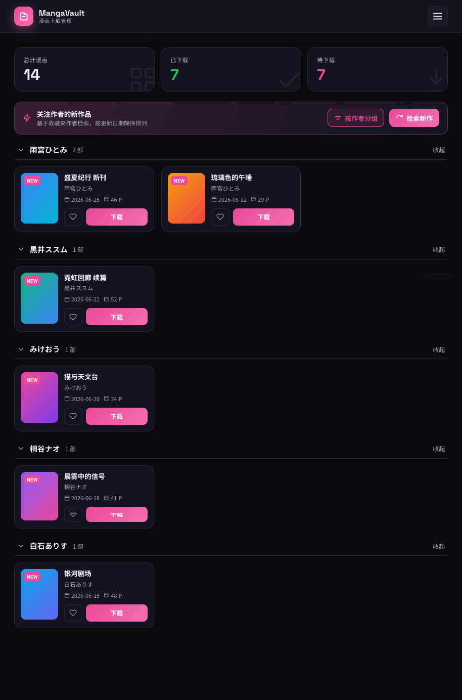

# MangaVault / 漫画下载管理 — デザイン仕様書 (Design Spec)

> Vibecoding 再現用リファレンス。色・タイポ・余白・角丸・シャドウ・アニメーション・全コンポーネント・インタラクション挙動を網羅。
> この1枚をプロンプトに貼れば同一ビジュアルを再構築できることを目的とする。値はすべて実装からの抽出（厳密値）。

---

## 0. デザイン原則

- **モダンで実用的**: 余白は詰めすぎず、情報密度と視認性のバランスを取る中庸トーン。
- **ダーク/ライト両対応**: CSS変数でトークン化し `--*` の値だけを差し替える。初期はダーク。
- **アクセントは1色**: マゼンタ寄りのピンク `#ec4899` を主役にし、他は無彩色グレースケールで支える。
- **状態は色で即伝達**: 已下载=緑 / 下载中=青 / 待下载=アクセント。
- **角丸は中〜大きめ**: ボタン9〜11px、カード14px、ダイアログ18px。柔らかく今っぽい印象。
- **動きは速く控えめ**: トランジションは0.15〜0.3s、イージングは `ease`。派手さより操作レスポンスを優先。
- **UI言語は簡体中文**で統一。数値・ロゴは `Space Grotesk`。

---

## 1. カラートークン

CSS変数としてルート要素に注入し、子は `var(--token)` を参照する。テーマ切替はこの変数値の差し替えのみで実現する。

### 1.1 ダークテーマ（既定）
| トークン | 値 | 用途 |
|---|---|---|
| `--bg` | `#0a0a0f` | ページ背景（最暗） |
| `--surface` | `#141420` | カード・ヘッダー・パネル面 |
| `--surface2` | `#1c1c2b` | 入力欄・セグメント・サブ面 |
| `--border` | `#262636` | 境界線・区切り |
| `--text` | `#f0f0f5` | 主テキスト |
| `--text2` | `#9a9ab0` | 副テキスト・アイコン淡色 |

### 1.2 ライトテーマ
| トークン | 値 |
|---|---|
| `--bg` | `#f4f4f8` |
| `--surface` | `#ffffff` |
| `--surface2` | `#f0f0f4` |
| `--border` | `#e4e4ec` |
| `--text` | `#16161d` |
| `--text2` | `#71718a` |

### 1.3 アクセント・状態色（テーマ共通）
| トークン | 値 | 用途 |
|---|---|---|
| `--accent` | `#ec4899` | 主アクション・選択・待下载・リンク強調 |
| `--accent2` | `color-mix(in srgb, var(--accent), white 22%)` ≒ `#ef6fac` | グラデーション終点・ハイライト |
| 状態:已下载 | `#22c55e`（緑） | DL完了バッジ・統計 |
| 状態:下载中 | `#3b82f6`（青） | DL進行中バッジ・進捗 |
| 状態:待下载 | `var(--accent)` | 未DLバッジ・統計 |
| 危険 | `#ef4444` | 削除ボタン・破壊的操作 |
| 純白 | `#ffffff` | アクセント上の文字・スイッチノブ |

**主グラデーション**: `linear-gradient(135deg, var(--accent), var(--accent2))` — ロゴ、主要ボタン、FAB、進捗バーに使用。

### 1.4 カバー用グラデーション（6種をindexで循環）
表紙プレースホルダはインデックス `c % 6` で割り当てる。
```
1: linear-gradient(135deg,#ec4899,#7c3aed)
2: linear-gradient(135deg,#3b82f6,#06b6d4)
3: linear-gradient(135deg,#f59e0b,#ef4444)
4: linear-gradient(135deg,#10b981,#3b82f6)
5: linear-gradient(135deg,#8b5cf6,#ec4899)
6: linear-gradient(135deg,#0ea5e9,#6366f1)
```
※ 実画像が用意できるまでの代替。実装時は `cover_image_url` を優先。

### 1.5 半透明・特殊
| 用途 | 値 |
|---|---|
| ヘッダー面（blur下地） | `color-mix(in srgb, var(--surface) 88%, transparent)` |
| カバー下グラデ（文字可読化） | `linear-gradient(180deg, transparent 35%, rgba(0,0,0,.72))` |
| ページ数チップ背景 | `rgba(0,0,0,.5)` + `backdrop-filter: blur(4px)` |
| DL中オーバーレイ | `rgba(0,0,0,.6)` + `backdrop-filter: blur(2px)` |
| ダイアログ遮蔽 | `rgba(0,0,0,.55)` + `backdrop-filter: blur(4px)` |
| アクセント淡面 | `color-mix(in srgb, var(--accent) 14%, var(--surface))` |
| アクセント淡枠 | `color-mix(in srgb, var(--accent) 35%, var(--border))` |

---

## 2. タイポグラフィ

### 2.1 フォントファミリー
- **本文/UI**: `"Noto Sans SC", system-ui, sans-serif` — ウェイト 300/400/500/700/900
- **ロゴ・数値・統計**: `"Space Grotesk", sans-serif` — ウェイト 500/700
- 読み込み: Google Fonts。`-webkit-font-smoothing: antialiased`。

```html
<link href="https://fonts.googleapis.com/css2?family=Noto+Sans+SC:wght@300;400;500;700;900&family=Space+Grotesk:wght@500;700&display=swap" rel="stylesheet">
```

### 2.2 タイプスケール（px / weight / family）
| 役割 | サイズ | 太さ | フォント | 補足 |
|---|---|---|---|---|
| ブランド名 | 16 | 700 | Space Grotesk | letter-spacing −.01em |
| ブランド副題 | 10.5 | 400 | Noto Sans SC | letter-spacing .04em / `--text2` |
| 統計ラベル | 11.5 | 500 | Noto Sans SC | letter-spacing .03em |
| 統計数値 | 30 | 700 | Space Grotesk | line-height 1.1 |
| タブ | 14 | 500/600 | Noto Sans SC | アクティブ600 |
| セクション見出し（作者） | 15 | 700 | Noto Sans SC | |
| ツールバー/ボタン | 13.5 | 500/600 | Noto Sans SC | |
| カードタイトル | 13 | 700 | Noto Sans SC | 2行省略・白文字 |
| カード作者 | 11.5 | 400 | Noto Sans SC | `--text2` |
| 状態バッジ | 10〜11 | 600/700 | Noto Sans SC | |
| ページ数チップ | 10.5 | 600 | Noto Sans SC | |
| 本文/ダイアログ | 13〜14 | 400/500 | Noto Sans SC | |
| トースト | 13 | 500 | Noto Sans SC | |

数値は `font-variant-numeric: tabular-nums`（進捗%・カウント）。

---

## 3. 余白・角丸・サイズ

### 3.1 角丸 (border-radius)
| 要素 | px |
|---|---|
| セグメント内ボタン / アイコンボタン小 | 8 |
| バッジ・チップ | 6〜8 |
| ボタン（標準） | 9〜11 |
| 入力欄 | 10〜11 |
| カード（コレクション/最近更新） | 14 |
| カバー上端 | 13（top-left/right のみ） |
| 統計カード | 16 |
| ダイアログ / 設定パネル | 18 |
| FAB | 18 |
| スイッチ（トグル） | 14（ピル） |
| ピル型バッジ（タブ件数等） | 20 |
| トースト | 12 |

### 3.2 主要寸法
| 要素 | 値 |
|---|---|
| ヘッダー高さ | 64px（sticky, top:0, z-index:40） |
| コンテンツ最大幅 | 1480px（中央寄せ） |
| 水平パディング | `clamp(14px, 3vw, 28px)` |
| 縦パディング(main) | `clamp(16px,3vw,30px)` 上下 / 下120px（FAB回避） |
| カードグリッド | `repeat(auto-fill, minmax(168px, 1fr))` / gap 16px |
| 最近更新グリッド | `repeat(auto-fill, minmax(260px, 1fr))` / gap 14px |
| 統計グリッド | `repeat(auto-fit, minmax(150px, 1fr))` / gap 12px |
| カバー比率 | `aspect-ratio: 3/4` |
| アイコンボタン | 38×38（ヘッダー）/ 32×32（カード内）/ 40×40（ハンバーガー） |
| 標準ボタン高 | 40px（ツールバー）/ 38px（ヘッダー）/ 36px（最近更新ヘッダ）/ 34px（選択バー）/ 32px（カード内） |
| FAB | 56×56（右18, 下24, z-index:45） |
| スイッチ | 44×26、ノブ20×20 |

### 3.3 ギャップの基本リズム
要素間 `gap` は **6 / 7 / 8 / 10 / 12 / 14 / 16px** を用途別に使い分け。ボタン内アイコン↔文字は 6〜7px。

---

## 4. シャドウ / ぼかし

| 用途 | 値 |
|---|---|
| ブランドロゴ（発光） | `0 6px 18px color-mix(in srgb, var(--accent) 45%, transparent)` |
| 「下载全部」ボタン | `0 6px 16px color-mix(in srgb, var(--accent) 40%, transparent)` |
| FAB | `0 10px 28px color-mix(in srgb, var(--accent) 50%, transparent)` |
| 選択中カード（リング） | `0 0 0 2px var(--accent)` |
| 状態バッジ | `0 2px 6px rgba(0,0,0,.3)` |
| スイッチノブ | `0 1px 3px rgba(0,0,0,.3)` |
| モバイルメニュー | `0 20px 50px rgba(0,0,0,.4)` |
| トースト | `0 12px 30px rgba(0,0,0,.4)` |
| 設定パネル | `0 30px 80px rgba(0,0,0,.5)` |

**backdrop-filter（ぼかし）**
| 用途 | 値 |
|---|---|
| ヘッダー | `blur(18px)` |
| ページ数チップ | `blur(4px)` |
| DL中オーバーレイ | `blur(2px)` |
| ダイアログ遮蔽 | `blur(4px)` |

> 通常状態のカードは shadow なし（`none`）。浮きは hover とリングで表現し、フラットさを基調にする。

---

## 5. アニメーション / トランジション

### 5.1 keyframes（`<style>` 内に定義）
```css
@keyframes spin    { to { transform: rotate(360deg); } }
@keyframes pulse   { 0%,100% { opacity: 1; } 50% { opacity: .4; } }
@keyframes shimmer { 0% { background-position: -200% 0; } 100% { background-position: 200% 0; } }
@keyframes slideUp { from { transform: translateY(16px); opacity: 0; } to { transform: translateY(0); opacity: 1; } }
@keyframes popIn   { from { transform: scale(.92); opacity: 0; } to { transform: scale(1); opacity: 1; } }
```

### 5.2 適用一覧
| 対象 | アニメーション |
|---|---|
| ローダー（同期/DL中スピナー） | `animation: spin 1s linear infinite` |
| モバイルメニュー出現 | `animation: slideUp .2s ease` |
| 選択アクションバー出現 | `animation: slideUp .2s ease` |
| トースト出現 | `animation: slideUp .25s ease` |
| 設定パネル出現 | `animation: popIn .2s ease` |
| `pulse` / `shimmer` | スケルトン/読込プレースホルダ向けに用意（任意） |

### 5.3 トランジション
| 対象 | プロパティ / 時間 / イージング |
|---|---|
| ルート（テーマ切替） | `background .3s ease, color .3s ease` |
| カード hover | `transform .18s ease, border-color .18s ease` |
| 折りたたみシェブロン | `transform .2s` |
| スイッチ背景 | `background .2s` |
| スイッチノブ位置 | `left .2s` |
| 同期バー進捗幅 | `width .3s ease` |
| カード内DL進捗幅 | （即時更新・transitionなし） |
| ゴーストボタン hover | `border-color` / `color` 即時（style-hover） |

---

## 6. コンポーネント仕様

### 6.1 ヘッダー (Header)
- sticky / 高さ64 / 背景 `color-mix(surface 88%, transparent)` + `backdrop-filter: blur(18px)` / 下境界 `1px var(--border)`。
- 内側: `max-width:1480px` 中央、`padding:0 clamp(14,3vw,28)`、`display:flex; align-items:center; gap:18px`。
- **ブランド**: 38×38ロゴ（角丸11、主グラデ、発光シャドウ、内に白アイコン20px）＋ 名前16/700 + 副題10.5。
- **タブ（PC）**: `display:flex; gap:4px`。各タブ高38・角丸10・padding 0 15。
  - アクティブ: 背景 `color-mix(accent 16%, transparent)`、文字 `var(--accent)`、太さ600、アイコン16px。
  - 非アクティブ: 透明背景、文字 `--text2`、太さ500。
  - 「最近更新」には件数ピル（10.5/700, padding 1px 6px, 角丸20）。アクティブ時アクセント背景+白、非アクティブ時 `--surface2`+`--text2`。
- **アクション（PC）**: Komga（ゴーストボタン:高38, 角丸10, 枠`--border`, 背景`--surface2`）、テーマ切替（38角アイコン）、設定（38角アイコン）。hover: 枠と文字が `--accent`。
- **モバイル**: タブ/アクションを隠し、ハンバーガー40×40（枠`--border`, 背景`--surface2`）を表示。

### 6.2 同期進捗ストリップ
- 同期中のみヘッダー直下に表示。上境界 `1px var(--border)`、背景 `--surface`。
- 中身: 回転スピナー15px（accent）+ ラベル12.5/500 + 進捗トラック（高5, 角丸4, 背景`--surface2`）+ バー（主グラデ, `transition: width .3s`）+ %数値（12, tabular-nums, 右寄せ, min-width38）。

### 6.3 統計カード (Stat Card)
- `auto-fit minmax(150px,1fr)` / gap12 / 3枚（总计・已下载・待下载）。
- 各カード: padding 16px 18px、角丸16、背景`--surface`、枠`1px --border`、`position:relative; overflow:hidden`。
- ラベル11.5/500（`--text2`）→ 数値30/700 Space Grotesk（总计=`--text`, 已下载=`#22c55e`, 待下载=`--accent`）。
- 右下に装飾SVGアイコン60px（`opacity .12〜.14`, 各状態色）。

### 6.4 ツールバー (Toolbar) ※コレクションタブのみ表示
`flex-wrap; align-items:center; gap:10px`。最近更新タブでは `display:none`。
- **検索入力**: `flex:1 1 220px`、高40、左にルーペ16px（絶対配置 left13）、padding `0 14 0 38`、角丸11、背景`--surface`、枠`--border`。focus時 枠`--accent`。
- **表示切替（カード/リスト）**: セグメント。外枠コンテナ（padding3, 角丸11, 枠`--border`, 背景`--surface`）内に34×30ボタン2つ（角丸8）。アクティブ=accent背景+白、非=透明+`--text2`。
- **排序セレクト**: `position:relative` ラッパ。`<select>` 高40・角丸11・枠`--border`・背景`--surface`・`appearance:none`・padding `0 34 0 13`。右にシェブロン14px（`pointer-events:none`）。選択肢: 默认排序 / 标题A→Z / 标题Z→A / 页数 多→少 / 页数 少→多 / 按状态。
- **「按作者分组」トグルボタン**: toolBtn。ON=accent枠+`color-mix(accent14%,surface)`背景+accent文字、OFF=`--border`枠+`--surface`背景+`--text`文字。
- **「选择」トグルボタン**: 同上スタイル。ON時ラベル「退出选择」。
- **「同步」ボタン**: ゴースト（高40, 角丸11, 枠`--border`, 背景`--surface`）。hover枠accent。
- **「下载全部」ボタン**: 主グラデ背景・白文字・高40・角丸11・発光シャドウ。末尾に件数バッジ（背景`rgba(255,255,255,.25)`, 角丸20）。待DL=0時 `opacity:.5`。

> toolBtn 共通: `inline-flex; gap:7; height:40; padding:0 14; radius:11; font 13.5/500`。

### 6.5 選択アクションバー
選択モード時のみ表示。`slideUp .2s`。背景`color-mix(accent 10%, surface)`、枠`color-mix(accent35%, border)`、角丸13、padding 11px 15px。「已选择 N 项」+ 削除ボタン（赤: 枠`#ef4444`, 背景`color-mix(#ef4444 14%)`, 文字赤）+ 取消（ゴースト）。

### 6.6 作者セクション見出し（折りたたみ）
- クリック可能な `<button>`（幅100%, 透明背景, 下境界`1px --border`, padding-bottom8, margin-bottom13, `cursor:pointer`, `text-align:left`）。
- 構成: シェブロン15px（`--text2`, 折畳時 `transform: rotate(-90deg)`, `transition .2s`）+ 作者名15/700 + 件数「N 部」12（`--text2`）+ 伸縮スペーサ + 「收起/展开」12（`--text2`）。
- 折畳状態は作者名キーの map で保持。コレクションと最近更新は**別々の状態**（`collapsed` / `rCollapsed`）。

### 6.7 漫画カード（カードビュー）
- ルート: `cursor:pointer; radius:14; 背景--surface; 枠1px(--border, 選択時accent); overflow:hidden`。選択時リング`0 0 0 2px accent`。
- **hover**: `transform: translateY(-4px)` + 枠 `color-mix(accent 55%, border)`（`transition .18s`）。
- **カバー**: `aspect-ratio 3/4`、角丸上13、背景=カバーグラデ。
  - 下グラデ覆い（文字可読化）。
  - 左下にタイトル13/700白（2行省略, text-shadow `0 1px 4px rgba(0,0,0,.5)`）。
  - 左上に状態バッジ（padding 3px8, 角丸7, 10/700白, 背景=状態色, シャドウ`0 2px 6px rgba(0,0,0,.3)`）。
  - 右上にページ数チップ（`rgba(0,0,0,.5)` + blur4, 10.5/600白, アイコン+「NNP」）。
  - 選択モード時 左上に22×22チェック（選択時accent背景, 枠1.5px白）。
  - DL中: 全面オーバーレイ（`rgba(0,0,0,.6)`+blur2）にスピナー26 + %12/600白 + 細進捗バー（幅70%, 高4, トラック`rgba(255,255,255,.25)`, バーaccent）。
- **フッター**: padding 9 11 11。作者11.5（`--text2`, 省略）+ アクション行（gap7）。
  - **※本アプリに「読む」機能は無い**。閲覧は ①カードクリック→原站で閲覧 ②DL済みは上部「Komga」ボタンでローカル閲覧、の2経路のみ。カード内に読書ボタンは置かない。
  - 主ボタン（`flex:1`, 高32, 角丸9, 12.5/600）: 未DL=主グラデ+白「下载」 / DL中=`--surface2`+`--text2`「NN%」 / 完了=緑系 `color-mix(in srgb,#22c55e 15%, var(--surface2))` + 緑文字「已下载」（`cursor:default`・非操作の状態表示）。**「下载」→「阅读」のラベル変化はさせない**（DL後そのまま読める誤解を防ぐ）。
  - 外部リンク↗ボタン32×32（ゴースト, hover=accent, title「在原站点打开」）: 原站の該当ページへ遷移。アイコンは「枠＋矢印（external-link）」。
  - 削除ボタン32×32（ゴースト, hover赤）。
  - **カード全体クリック = 原站へ遷移**（いつでもオンライン閲覧可）。DL済みのローカル閲覧は上部Komgaボタン。この3経路を視覚的に分離し「DL＝その場で読める」という誤解を排除する。

### 6.8 漫画行（リストビュー）
- `flex; align-items:center; gap:13; padding:10 13; radius:12; 背景--surface; 枠1px(選択時accent)`。hover枠`color-mix(accent50%,border)`。
- 選択チェック20×20（選択モード時）+ ミニカバー42×56（角丸8, グラデ）+ タイトル14/600&作者・页数12（`--text2`）+ 状態バッジ（淡色: 文字=状態色, 背景`color-mix(状態色15%)`, 角丸7）。
- DL中は行内に進捗（トラック90×5 + %11.5）を表示しバッジ/主ボタンを隠す。
- 主ボタン（高32, padding0 16, 角丸9）: 未DL=主グラデ「下载」。**完了行はボタンを出さず緑「已下载」バッジのみ**（カードビュー同様「阅读」化しない）。

### 6.9 最近更新カード
- 横並び: `flex; gap:12; padding:12; radius:14; 背景--surface; 枠1px`。hover枠`color-mix(accent45%,border)`。
- 左: カバー74×100（角丸10, グラデ）。左上に「NEW」バッジ（accent背景白9.5/700, 角丸6）。
- 右: タイトル13.5/600（2行省略）+ 作者11.5 + メタ行（日付・页数, アイコン付11, `--text2`）+ 伸縮 + アクション行（gap7）:
  - **ハート（站点收藏）** 36×34: 未収藏=枠`--border`+`--text2`+`fill:none` / 収藏済=accent枠+`color-mix(accent14%)`背景+accent+`fill:accent`。
  - **下载ボタン** `flex:1` 高34: 主グラデ「下载」/ 追加済=`--surface2`+`--text2`「已加入」。
- 上部に告知バー（`linear-gradient(120deg, color-mix(accent16%,surface), surface)`, 枠`color-mix(accent30%,border)`, 角丸14）。雷アイコン + 説明 + 「按作者分组」トグル + 「检索新作」ボタン（主グラデ, 高36）。
  - ※「同步＝新作検索」のため最近更新タブのトリガは**「检索新作」1つに統一**（共通ツールバーの同步は非表示）。

### 6.10 設定ダイアログ
- 遮蔽: `fixed inset0, z60, rgba(0,0,0,.55)+blur4, 中央寄せ, padding18`。
- パネル: `min(440px,100%)`, `max-height90vh; overflow:auto`, 角丸18, 背景`--surface`, 枠`--border`, シャドウ`0 30px 80px rgba(0,0,0,.5)`, `popIn .2s`。
- ヘッダー: 歯車アイコン(accent)+「设置」16/700 + 閉じる32×32(`--surface2`)。下境界。
- 本文: 手动站点域名 入力（高40, 角丸10, 背景`--surface2`）+ 注記11 / 「显示封面预览」スイッチ行（`--surface2`面, 角丸11）/ 保存ボタン（高44, 主グラデ, 白14/600）。
  - ※「按作者分类显示」トグルは**設定から削除**（ツールバーに常設のため重複排除）。

### 6.11 スイッチ (Toggle)
- トラック44×26, 角丸14, `border:none`。ON=accent / OFF=`--border`。`transition background .2s`。
- ノブ20×20白丸, `position:absolute; top3`, ON時`left21` / OFF時`left3`, `transition left .2s`, シャドウ`0 1px 3px rgba(0,0,0,.3)`。

### 6.12 FAB（モバイル）
- 56×56, 角丸18, 右18/下24, z45, 主グラデ, 発光`0 10px 28px color-mix(accent50%)`, 白回転矢印アイコン24。タップで収藏夹同步。

### 6.13 トースト
- `fixed; left50% translateX(-50%); z70`, 下=デスクトップ28/モバイル92。padding 11 20, 角丸12, 背景`--text` 文字`--bg`（反転）, 13/500, シャドウ`0 12px 30px rgba(0,0,0,.4)`, `slideUp .25s`。2.2秒で自動消滅。

### 6.14 モバイルドロップダウンメニュー
- `fixed; top64; left/right10; z39`, 角丸14, 背景`--surface`, 枠`--border`, シャドウ`0 20px 50px rgba(0,0,0,.4)`, `slideUp .2s`。
- 中身: 収藏夹 / 最近更新(件数) タブ + 区切り線 + Komga / テーマ切替(現在値) / 设置。各項目 padding 11 14, 角丸9, 14px。

### 6.15 スクロールバー
```css
::-webkit-scrollbar { width:10px; height:10px; }
::-webkit-scrollbar-thumb { background: var(--border); border-radius:8px; }
::-webkit-scrollbar-track { background: transparent; }
```

---

## 7. レスポンシブ

- **ブレークポイント**: `window.innerWidth < 820` を「モバイル」と判定（JSで `isMobile` を状態管理し `resize` 監視）。
- **デスクトップ (≥820)**: ヘッダーにタブ＋アクション。FAB/ハンバーガー非表示。トースト下28。
- **モバイル (<820)**: ヘッダーのタブ・アクションを隠しハンバーガー表示 → ドロップダウンメニュー。右下にFAB（同步）。トースト下92（FAB回避）。
- グリッドは `auto-fill/auto-fit minmax()` により列数が自動調整（メディアクエリ不要）。カード168px下限、最近更新260px下限。
- 最大幅1480pxで中央寄せ、横padding `clamp(14,3vw,28)`。

---

## 8. インタラクション挙動（状態とロジック）

| 操作 | 挙動 |
|---|---|
| テーマ切替 | `--*` 変数をダーク/ライトで差替。ルートに`transition .3s`で滑らかに遷移。太陽/月アイコンを出し分け。 |
| タブ切替 | 収藏夹 ⇄ 最近更新。ツールバー・統計はコレクション側、最近更新側は専用バー。 |
| 検索 | タイトル/作者の部分一致（小文字化）でフィルタ。0件は空状態（ルーペ＋「没有匹配的漫画」）。 |
| 並び替え | 默认 / 标题A→Z(localeCompare 'zh') / 标题Z→A / 页数 多→少 / 页数 少→多 / 按状态(下载中→待下载→已下载)。 |
| 作者分组 | ON で作者ごとにセクション化（出現順保持）。各見出しクリックで折りたたみ。コレクションと最近更新は独立状態。 |
| 選択モード | カバー左上/行頭にチェック表示。カードクリックで選択トグル。下部に一括削除バー（slideUp）。 |
| 単体DL | クリックで `downloading` 化→ティッカーで進捗。完了で `downloaded`。 |
| DLシミュレーション | `setInterval 240ms`、各件 `+5〜13%`。100%到達で完了化しキューから除外。全完了でティッカー停止。 |
| 下载全部 | 待DL全件を 180ms間隔で順次キュー投入。トースト「已加入下载队列 · N 部」。 |
| 同期/检索新作 | `setInterval 220ms`、`+6〜15%`。100%で完了トースト、0.5s後にストリップを閉じる。 |
| 站点收藏（ハート） | 最近更新カードのみ。トグルで `fill` と枠色が反転。トースト通知。 |
| 削除 | カード/行の削除ボタン or 一括削除。即時にリストから除去しトースト。 |
| トースト | 任意操作のフィードバック。2.2秒表示後フェードアウト（再表示でタイマーリセット）。 |

---

## 9. 実装メモ（再現時の指針）

1. **トークン優先**: 生のhexを直書きせず、まず `--bg/--surface/--surface2/--border/--text/--text2/--accent/--accent2` を定義 → 全要素は `var()` 参照。テーマ切替は変数値の差替のみ。
2. **アクセント派生**は `color-mix(in srgb, var(--accent), white 22%)`。淡面/淡枠も `color-mix` で派生し、アクセント変更1箇所で全体追従させる。
3. **フラット基調 + 選択/hoverで浮き**: 通常カードはシャドウなし。浮きは `translateY(-4px)` とリング、アクセント枠で表現。
4. **発光シャドウ**はアクセント由来（`color-mix(accent NN%, transparent)`）に限定し、主要CTA（下载全部・FAB・ロゴ）だけに使う。乱用しない。
5. **動きは0.15〜0.3s/ease**で統一。出現は `slideUp`（下から）か `popIn`（拡大）。ローダーは `spin 1s linear infinite`。
6. **角丸スケール**を守る（小8→ボタン9-11→カード14→ダイアログ18）。混在させない。
7. **数値はSpace Grotesk + tabular-nums**、本文は Noto Sans SC。中文UIで統一。
8. **レスポンシブはJS判定(820px)** + `auto-fill minmax()`。メディアクエリは最小限。
9. **状態色の意味を固定**: 緑=完了 / 青=進行中 / アクセント=待機 / 赤=破壊的。
10. 表紙は実画像優先、無ければ6種グラデを `index % 6` で割当。

---

---

## 10. スクリーンショット・ギャラリー（各画面・状態）

実装からの実画面キャプチャ。再現時の最終確認用リファレンス。**いずれもダークテーマ**（ライトは同一構成で §1.2 のトークンに差替）。

### 10.1 収藏夹 — カードビュー（全体・縦長 / 作者分组ON）

ページ全体を縦に連結したショット。ヘッダー（ロゴ・タブ・Komga/テーマ/設定）＋3統計カード（总计/已下载/待下载）＋ツールバー（検索・カード/リスト切替・排序・按作者分组・选择・同步・下载全部）＋作者セクション（雨宫ひとみ〜白石ありす、各見出しに「收起」で折りたたみ可）＋カードグリッド。
**各カードの閲覧導線**：状態バッジ（已下载=緑/待下载=ピンク）＋ページ数チップ。フッターは ①状態/DLボタン（完了は緑「已下载」＝非操作の状態表示・「阅读」化しない／未DLはピンク「下载」）②外部リンク↗（原站の該当ページへ）③削除。**読書機能はカードに無い**（オンライン閲覧=カード/↗、ローカル閲覧=上部Komga）。

### 10.2 収藏夹 — リストビュー

行レイアウト：ミニカバー＋タイトル/作者・页数＋右端に状態（完了=緑「已下载」バッジ風／未DL=ピンク「下载」ボタン）。完了行はボタンを出さずバッジのみ。

### 10.3 選択モード（一括操作）

「选择」→「退出选择」に変化。行頭/カバー左上にチェック、下部に選択アクションバー（已选择 N 项 / 删除所选 / 取消）。

### 10.4 最近更新タブ（作者分组ON）

告知バー「关注作者的新作品」＋「按作者分组」トグル＋「检索新作」（同步と統合し1ボタン）。作者ごとにグループ化（折りたたみ可）、横型カード＝NEWバッジ・日付・页数・站点收藏ハート・「下载」。

### 10.5 設定モーダル

歯車アイコン＋「设置」＋閉じる×。手动站点域名 入力＋注記、「显示封面预览」トグル（ON=ピンク）、主グラデの「保存设置」ボタン。実機では `rgba(0,0,0,.55)+blur4` の遮蔽上に `popIn .2s` で中央表示。
（※「按作者分类显示」トグルは設定から削除済み＝ツールバーに常設のため重複排除）

> **ライトテーマ**：同一レイアウトで `--*` トークンのみ差替（背景 `#f4f4f8` / 面 `#fff` / 文字 `#16161d`、§1.2 参照）。テーマ切替は `transition .3s`。
> **モバイル（<820px）**：ヘッダーのタブ/アクションがハンバーガー＋ドロップダウンメニューに、右下に同步FAB（§6.12/§6.14/§7）。グリッドは `auto-fill minmax()` で列数自動。

---

*対象実装: `漫画下载管理.dc.html`（MangaVault フロントエンド）。本書の値はすべて当該実装からの抽出。スクリーンショットは `screenshots/` に格納。*
